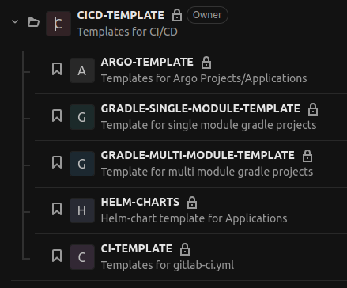
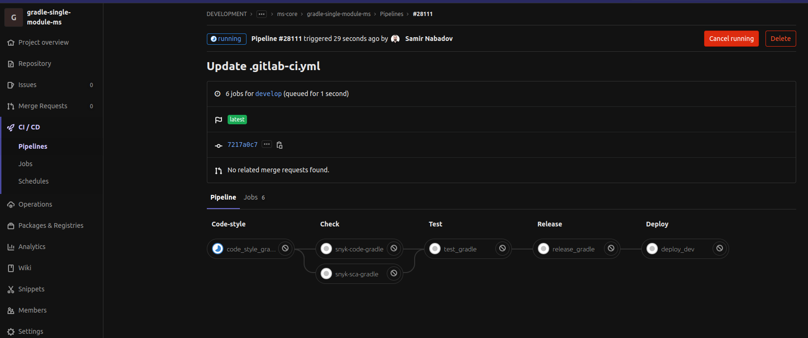
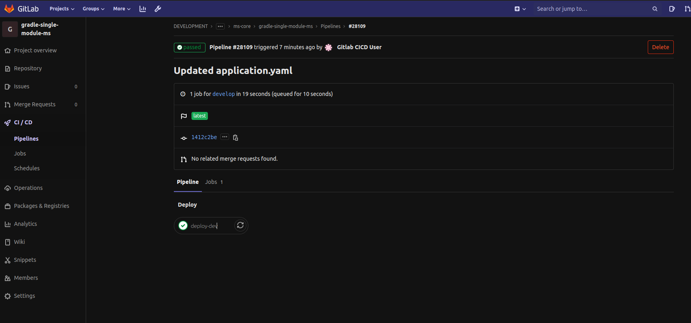
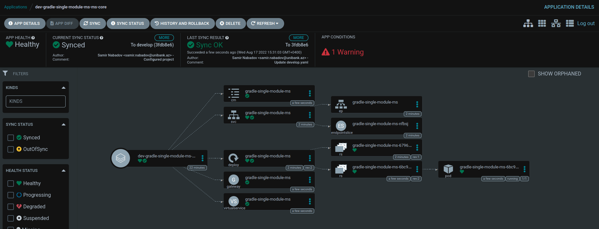
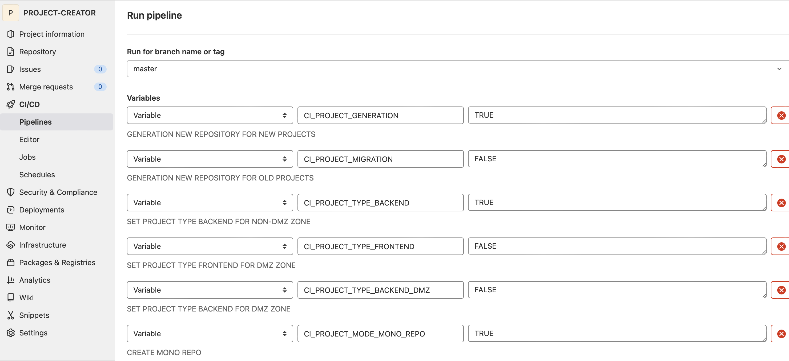

__Automation CI/CD with Python based script (GitOps Approach)__
================================

Here, I tried to automate the processes from creating a Gitlab project to deploying it to the environment, ensuring that nothing was done manually. This repo contains Python based script with there custom modules and pre-made templates for CI/CD.

What Python based Script Do:
------------
* Checks for subgroups under the main group, and create them if they doesn't exist.
* Checks for projects under subgroups and creates them if they don't exist.
* Creates multi module or mono repo projects based on given environment variables.
* Clone the template and newly created repos, then modify the necessary changes in the .gitlab-ci.yml, helm charts, templates and add to existing projects, then push to Gitlab.
* Repositories with helm charts are joined to ArgoCD before projects and applications are created through the pipeline in ArgoCD.
* Provides user access to newly created and templated projects based on given environment variables (MAINTAINER,DEVELOPER,REPORTER).
* Applying of container registry policies (rotation for deleting old images)

These templates include:
* CI Templates
* Helm Charts
* Argo templates
* Gradle single module project skeleton

-------------------------------------------

Gitlab CI
------------
* Template jobs have been written for the Pipeline (single-module/multi-module projects).
    - code-style (with SonarQube)
    - check (with Snyk)
    - test (Testing code)
    - release (Building images)
    - push-to-helm (Push to helm)
    - argocd-sync (Sync Argo)
* Included Python script for generation dynamic pipeline for multi-module projects (https://github.com/SamirNabadov/Dynamic-Pipeline-Generation).
* Used Jib and Kaniko to build and push images to gitlab registry.

Helm Charts
------------
* The Values file is designed for two branches (Develop / Master).
* When configmap is enabled, it is automatically set to the deployment file in the template.
* To add secrets to the deployment file, they must first be created inside the cluster, then the required data must be set in the values file.
* Consideration of multiple routing in Istio Gateway Virtualservice.
* Consideration of multiple pvc mounts in Deployment.
* The TLS have been set up at the Istio gateway (Secret must be created inside the cluster and the name must be specified in the appropriate place in the values file).

ArgoCD
------------
* Template for project creation.
* Template for creating applications according to single module project.
* Template for creating applications according to multi module project.

In this approach, CI and CD are separated into repos, I have separated them into groups in gitlab. That is, the source code is in a separate group and repo and the deployment is in other groups and repos.

-------------------------------------------

The construction of CI/CD on this structure is automated using a python-based script. So the script first:
* In the pre-created Development group, create a subgroup corresponding to the name of the project and create a repo corresponding to the name of the microservice under the subgroup. A subgroup with the same name cannot be created, and a repo with the same name cannot be created in each subgroup.
* Then in the repo where the source code in the CODE subgroup will be, if the project type is gradle, it adds its template and the .gitlab-ci.yaml file. That .gitlab-ci.yaml file contains project-specific conditions that call jobs for the pipeline from the main gitlab-ci-template.yml.

-------------------------------------------

* Helm charts are placed in the CHART subgroup repos. (For both dev and prod environments).
* The files necessary for the declarative deployment of ArgoCD and the .gitlab-ci.yml file are placed in the APPLICATION and PROJECT subgroups.

-------------------------------------------

* Repos with Helm Charts are joined to ArgoCD.
* Finally, the microservice is deployed to dev and prod environments with ArgoCD.

-------------------------------------------

Running the Script from pipeline
------------

* Fill in the necessary parameters in the variable section and run the pipeline.

__Note__
------------
* These written templates and script are suitable for an environment with 4 Kubernetes Clusters with ArgoCD configured on each.

__Requirements__
------------
* Gitlab
* Python
* Kubernetes
* ArgoCD

__Author Information__
------------------

Samir Nabadov
